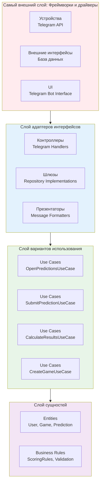

```mermaid
flowchart TD
    subgraph External ["Самый внешний слой: Фреймворки и драйверы"]
        F1[Устройства<br>Telegram API]
        F2[Внешние интерфейсы<br>База данных]
        F3[UI<br>Telegram Bot Interface]
    end
    
    subgraph InterfaceAdapters ["Слой адаптеров интерфейсов"]
        A1[Контроллеры<br>Telegram Handlers]
        A2[Шлюзы<br>Repository Implementations]
        A3[Презентаторы<br>Message Formatters]
    end
    
    subgraph Application ["Слой вариантов использования"]
        U1[Use Cases<br>OpenPredictionsUseCase]
        U2[Use Cases<br>SubmitPredictionUseCase]
        U3[Use Cases<br>CalculateResultsUseCase]
        U4[Use Cases<br>CreateGameUseCase]
    end
    
    subgraph Domain ["Слой сущностей"]
        D1[Entities<br>User, Game, Prediction]
        D2[Business Rules<br>ScoringRules, Validation]
    end
    
    External --> InterfaceAdapters
    InterfaceAdapters --> Application
    Application --> Domain
    
    style External fill:#ffebee
    style InterfaceAdapters fill:#e3f2fd
    style Application fill:#e8f5e8
    style Domain fill:#f3e5f5
```