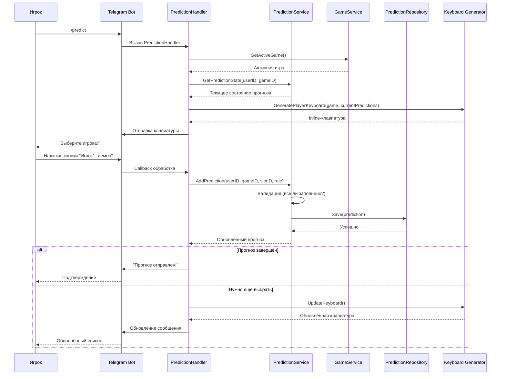

```mermaid
sequenceDiagram
    participant Player as Игрок
    participant Bot as Telegram Bot
    participant Handler as PredictionHandler
    participant PService as PredictionService
    participant GService as GameService
    participant Repo as PredictionRepository
    participant Keyboard as Keyboard Generator
    
    Player->>Bot: /predict
    Bot->>Handler: Вызов PredictionHandler
    Handler->>GService: GetActiveGame()
    GService-->>Handler: Активная игра
    Handler->>PService: GetPredictionState(userID, gameID)
    PService-->>Handler: Текущее состояние прогноза
    Handler->>Keyboard: GeneratePlayerKeyboard(game, currentPredictions)
    Keyboard-->>Handler: Inline-клавиатура
    Handler->>Bot: Отправка клавиатуры
    Bot-->>Player: "Выберите игрока:"
    
    Player->>Bot: Нажатие кнопки "Игрок1: демон"
    Bot->>Handler: Callback обработка
    Handler->>PService: AddPrediction(userID, gameID, slotID, role)
    PService->>PService: Валидация (все ли заполнено?)
    PService->>Repo: Save(prediction)
    Repo-->>PService: Успешно
    PService-->>Handler: Обновлённый прогноз
    
    alt Прогноз завершён
        Handler->>Bot: "Прогноз отправлен!"
        Bot-->>Player: Подтверждение
    else Нужно ещё выбрать
        Handler->>Keyboard: UpdateKeyboard()
        Keyboard-->>Handler: Обновлённая клавиатура
        Handler->>Bot: Обновление сообщения
        Bot-->>Player: Обновлённый список
    end
```