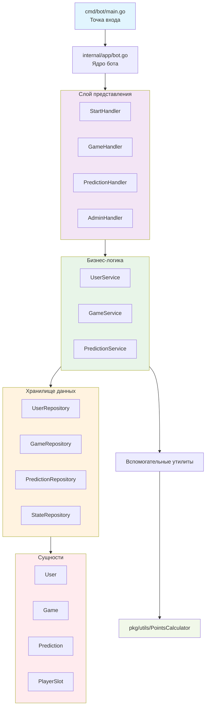

```mermaid
flowchart TD
    A[cmd/bot/main.go<br>Точка входа] --> B[internal/app/bot.go<br>Ядро бота]
    B --> C[Telegram Handlers]
    
    subgraph C [Слой представления]
        C1[StartHandler]
        C2[GameHandler]
        C3[PredictionHandler]
        C4[AdminHandler]
    end
    
    C --> D[Слой сервисов]
    
    subgraph D [Бизнес-логика]
        D1[UserService]
        D2[GameService]
        D3[PredictionService]
    end
    
    D --> E[Слой репозиториев]
    
    subgraph E [Хранилище данных]
        E1[UserRepository]
        E2[GameRepository]
        E3[PredictionRepository]
        E4[StateRepository]
    end
    
    E --> F[Доменные модели]
    
    subgraph F [Сущности]
        F1[User]
        F2[Game]
        F3[Prediction]
        F4[PlayerSlot]
    end
    
    D --> G[Вспомогательные утилиты]
    G --> H[pkg/utils/PointsCalculator]
    
    style A fill:#e1f5fe
    style C fill:#f3e5f5
    style D fill:#e8f5e8
    style E fill:#fff3e0
    style F fill:#ffebee
    style H fill:#f1f8e9
```