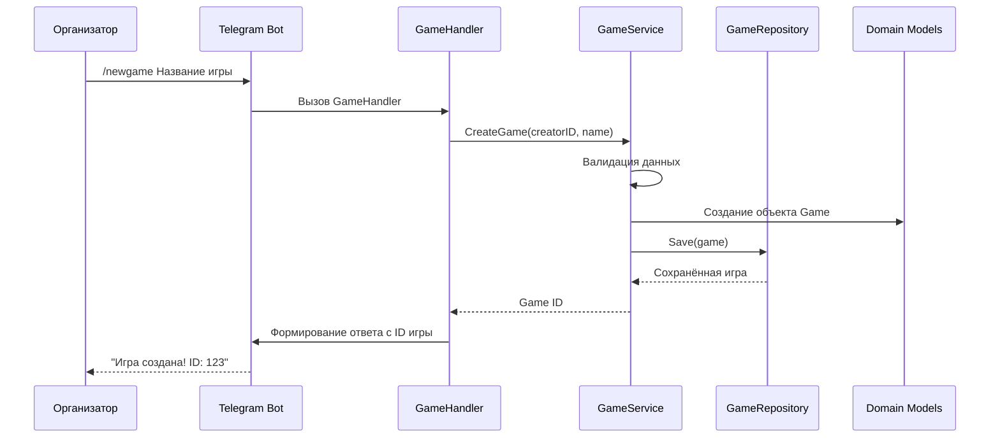

```mermaid
sequenceDiagram
    participant User as Организатор
    participant Bot as Telegram Bot
    participant Handler as GameHandler
    participant Service as GameService
    participant Repo as GameRepository
    participant Domain as Domain Models
    
    User->>Bot: /newgame Название игры
    Bot->>Handler: Вызов GameHandler
    Handler->>Service: CreateGame(creatorID, name)
    Service->>Service: Валидация данных
    Service->>Domain: Создание объекта Game
    Service->>Repo: Save(game)
    Repo-->>Service: Сохранённая игра
    Service-->>Handler: Game ID
    Handler->>Bot: Формирование ответа с ID игры
    Bot-->>User: "Игра создана! ID: 123"
```