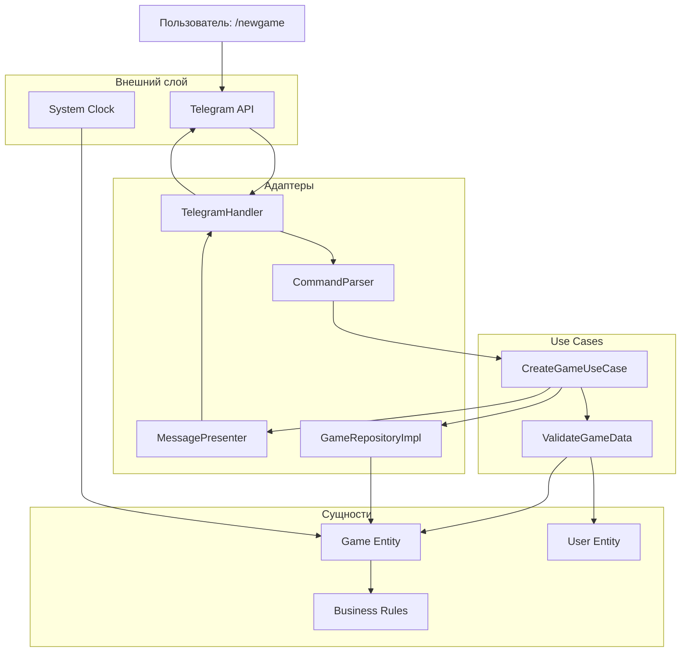

```mermaid
flowchart TD
    Start[Пользователь: /newgame] --> Telegram
    
    subgraph ExternalLayer [Внешний слой]
        Telegram[Telegram API]
        Clock[System Clock]
    end
    
    subgraph InterfaceAdaptersLayer [Адаптеры]
        Handler[TelegramHandler]
        Parser[CommandParser]
        Presenter[MessagePresenter]
        RepoImpl[GameRepositoryImpl]
    end
    
    subgraph ApplicationLayer [Use Cases]
        CreateGame[CreateGameUseCase]
        Validate[ValidateGameData]
    end
    
    subgraph DomainLayer [Сущности]
        GameEntity[Game Entity]
        UserEntity[User Entity]
        Rules[Business Rules]
    end
    
    Telegram --> Handler
    Handler --> Parser
    Parser --> CreateGame
    CreateGame --> Validate
    Validate --> GameEntity
    Validate --> UserEntity
    GameEntity --> Rules
    CreateGame --> RepoImpl
    RepoImpl --> GameEntity
    CreateGame --> Presenter
    Presenter --> Handler
    Handler --> Telegram
    
    Clock --> GameEntity
```