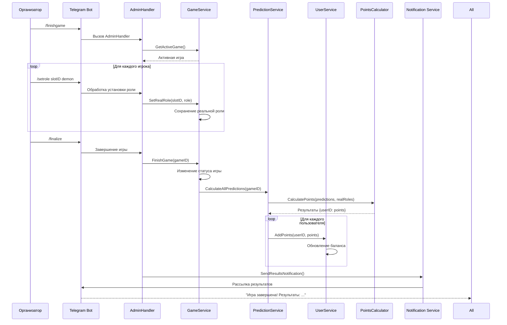

```mermaid
sequenceDiagram
    participant Admin as Организатор
    participant Bot as Telegram Bot
    participant Handler as AdminHandler
    participant GService as GameService
    participant PService as PredictionService
    participant UService as UserService
    participant Calculator as PointsCalculator
    participant Notify as Notification Service
    
    Admin->>Bot: /finishgame
    Bot->>Handler: Вызов AdminHandler
    Handler->>GService: GetActiveGame()
    GService-->>Handler: Активная игра
    
    loop Для каждого игрока
        Admin->>Bot: /setrole slotID demon
        Bot->>Handler: Обработка установки роли
        Handler->>GService: SetRealRole(slotID, role)
        GService->>GService: Сохранение реальной роли
    end
    
    Admin->>Bot: /finalize
    Bot->>Handler: Завершение игры
    Handler->>GService: FinishGame(gameID)
    GService->>GService: Изменение статуса игры
    
    GService->>PService: CalculateAllPredictions(gameID)
    PService->>Calculator: CalculatePoints(predictions, realRoles)
    Calculator-->>PService: Результаты {userID: points}
    
    loop Для каждого пользователя
        PService->>UService: AddPoints(userID, points)
        UService->>UService: Обновление баланса
    end
    
    Handler->>Notify: SendResultsNotification()
    Notify->>Bot: Рассылка результатов
    Bot-->>All: "Игра завершена! Результаты: ..."
```