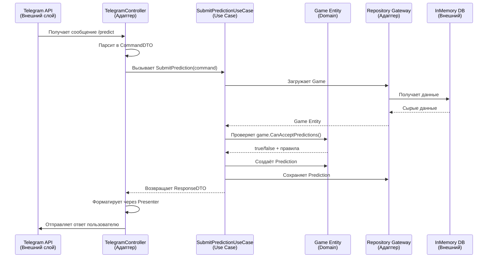

```mermaid
sequenceDiagram
    participant Telegram as Telegram API<br>(Внешний слой)
    participant Controller as TelegramController<br>(Адаптер)
    participant UseCase as SubmitPredictionUseCase<br>(Use Case)
    participant Entity as Game Entity<br>(Domain)
    participant Repo as Repository Gateway<br>(Адаптер)
    participant DB as InMemory DB<br>(Внешний)
    
    Telegram->>Controller: Получает сообщение /predict
    Controller->>Controller: Парсит в CommandDTO
    Controller->>UseCase: Вызывает SubmitPrediction(command)
    
    UseCase->>Repo: Загружает Game
    Repo->>DB: Получает данные
    DB-->>Repo: Сырые данные
    Repo-->>UseCase: Game Entity
    
    UseCase->>Entity: Проверяет game.CanAcceptPredictions()
    Entity-->>UseCase: true/false + правила
    
    UseCase->>Entity: Создаёт Prediction
    UseCase->>Repo: Сохраняет Prediction
    
    UseCase-->>Controller: Возвращает ResponseDTO
    Controller->>Controller: Форматирует через Presenter
    Controller->>Telegram: Отправляет ответ пользователю
```