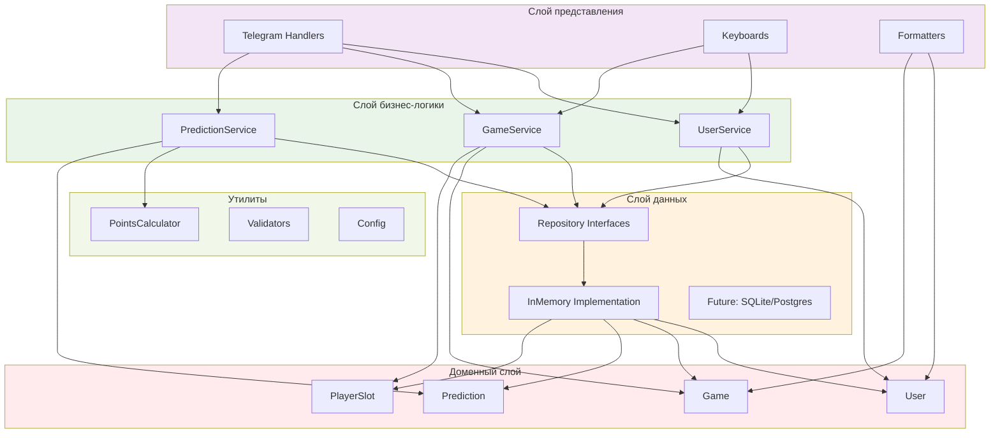

```mermaid
flowchart TD
    subgraph PresentationLayer [Слой представления]
        A1[Telegram Handlers]
        A2[Keyboards]
        A3[Formatters]
    end
    
    subgraph BusinessLayer [Слой бизнес-логики]
        B1[UserService]
        B2[GameService]
        B3[PredictionService]
    end
    
    subgraph DataLayer [Слой данных]
        C1[Repository Interfaces]
        C2[InMemory Implementation]
        C3[Future: SQLite/Postgres]
    end
    
    subgraph DomainLayer [Доменный слой]
        D1[User]
        D2[Game]
        D3[Prediction]
        D4[PlayerSlot]
    end
    
    subgraph Utilities [Утилиты]
        E1[PointsCalculator]
        E2[Validators]
        E3[Config]
    end
    
    A1 --> B1
    A1 --> B2
    A1 --> B3
    A2 --> B1
    A2 --> B2
    A3 --> D1
    A3 --> D2
    
    B1 --> C1
    B2 --> C1
    B3 --> C1
    B3 --> E1
    
    C1 --> C2
    C2 --> D1
    C2 --> D2
    C2 --> D3
    C2 --> D4
    
    B1 --> D1
    B2 --> D2
    B2 --> D4
    B3 --> D3
    
    style PresentationLayer fill:#f3e5f5
    style BusinessLayer fill:#e8f5e8
    style DataLayer fill:#fff3e0
    style DomainLayer fill:#ffebee
    style Utilities fill:#f1f8e9
```