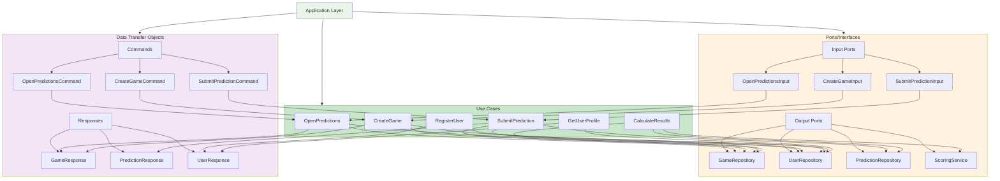

```mermaid
flowchart TD
    AppLayer[Application Layer]
    
    AppLayer --> UseCases
    AppLayer --> Ports
    AppLayer --> DTOs
    
    subgraph UseCases [Use Cases]
        UC1[OpenPredictions]
        UC2[SubmitPrediction]
        UC3[CalculateResults]
        UC4[CreateGame]
        UC5[RegisterUser]
        UC6[GetUserProfile]
    end
    
    subgraph Ports [Ports/Interfaces]
        direction LR
        InPorts[Input Ports] --> In1[OpenPredictionsInput]
        InPorts --> In2[SubmitPredictionInput]
        InPorts --> In3[CreateGameInput]
        
        OutPorts[Output Ports] --> Out1[GameRepository]
        OutPorts --> Out2[UserRepository]
        OutPorts --> Out3[PredictionRepository]
        OutPorts --> Out4[ScoringService]
    end
    
    subgraph DTOs [Data Transfer Objects]
        direction LR
        Commands[Commands] --> Cmd1[OpenPredictionsCommand]
        Commands --> Cmd2[SubmitPredictionCommand]
        Commands --> Cmd3[CreateGameCommand]
        
        Responses[Responses] --> Resp1[GameResponse]
        Responses --> Resp2[PredictionResponse]
        Responses --> Resp3[UserResponse]
    end
    
    %% Связи
    In1 --> UC1
    In2 --> UC2
    In3 --> UC4
    
    UC1 --> Out1
    UC1 --> Out2
    UC2 --> Out1
    UC2 --> Out2
    UC2 --> Out3
    UC3 --> Out1
    UC3 --> Out3
    UC3 --> Out4
    UC4 --> Out1
    UC4 --> Out2
    UC5 --> Out2
    UC6 --> Out2
    
    Cmd1 --> UC1
    Cmd2 --> UC2
    Cmd3 --> UC4
    
    UC1 --> Resp1
    UC2 --> Resp2
    UC4 --> Resp1
    UC5 --> Resp3
    UC6 --> Resp3
    
    style AppLayer fill:#e8f5e8
    style UseCases fill:#c8e6c9
    style Ports fill:#fff3e0
    style DTOs fill:#f3e5f5
```