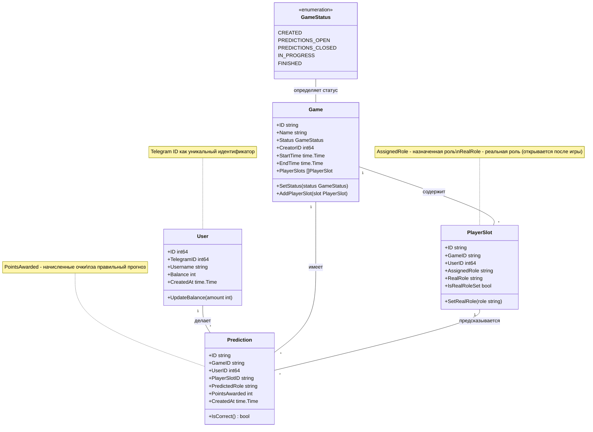

```mermaid
classDiagram
    class User {
        +ID int64
        +TelegramID int64
        +Username string
        +Balance int
        +CreatedAt time.Time
        +UpdateBalance(amount int)
    }
    
    class Game {
        +ID string
        +Name string
        +Status GameStatus
        +CreatorID int64
        +StartTime time.Time
        +EndTime time.Time
        +PlayerSlots []PlayerSlot
        +SetStatus(status GameStatus)
        +AddPlayerSlot(slot PlayerSlot)
    }
    
    class PlayerSlot {
        +ID string
        +GameID string
        +UserID int64
        +AssignedRole string
        +RealRole string
        +IsRealRoleSet bool
        +SetRealRole(role string)
    }
    
    class Prediction {
        +ID string
        +GameID string
        +UserID int64
        +PlayerSlotID string
        +PredictedRole string
        +PointsAwarded int
        +CreatedAt time.Time
        +IsCorrect() bool
    }
    
    class GameStatus {
        <<enumeration>>
        CREATED
        PREDICTIONS_OPEN
        PREDICTIONS_CLOSED
        IN_PROGRESS
        FINISHED
    }
    
    User "1" -- "*" Prediction : делает
    Game "1" -- "*" PlayerSlot : содержит
    Game "1" -- "*" Prediction : имеет
    PlayerSlot "1" -- "*" Prediction : предсказывается
    GameStatus -- Game : определяет статус
    
    note for User "Telegram ID как уникальный идентификатор"
    note for PlayerSlot "AssignedRole - назначенная роль\nRealRole - реальная роль (открывается после игры)"
    note for Prediction "PointsAwarded - начисленные очки\nза правильный прогноз"
```