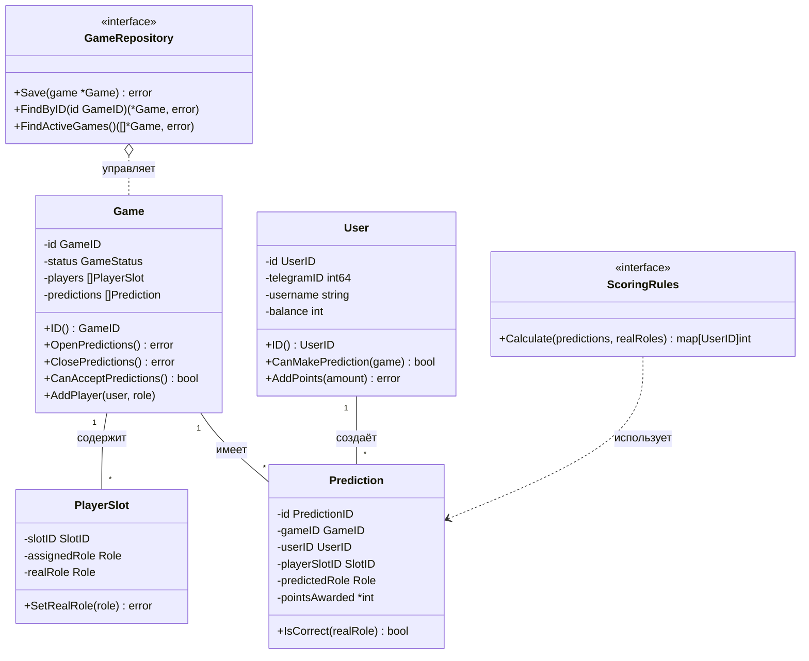

```mermaid
classDiagram
    class User {
        -id UserID
        -telegramID int64
        -username string
        -balance int
        +ID() UserID
        +CanMakePrediction(game) bool
        +AddPoints(amount) error
    }
    
    class Game {
        -id GameID
        -status GameStatus
        -players []PlayerSlot
        -predictions []Prediction
        +ID() GameID
        +OpenPredictions() error
        +ClosePredictions() error
        +CanAcceptPredictions() bool
        +AddPlayer(user, role)
    }
    
    class Prediction {
        -id PredictionID
        -gameID GameID
        -userID UserID
        -playerSlotID SlotID
        -predictedRole Role
        -pointsAwarded *int
        +IsCorrect(realRole) bool
    }
    
    class PlayerSlot {
        -slotID SlotID
        -assignedRole Role
        -realRole Role
        +SetRealRole(role) error
    }
    
    class ScoringRules {
        <<interface>>
        +Calculate(predictions, realRoles) map[UserID]int
    }
    
    class GameRepository {
        <<interface>>
        +Save(game *Game) error
        +FindByID(id GameID) (*Game, error)
        +FindActiveGames() ([]*Game, error)
    }
    
    Game "1" -- "*" PlayerSlot : содержит
    Game "1" -- "*" Prediction : имеет
    User "1" -- "*" Prediction : создаёт
    ScoringRules ..> Prediction : использует
    GameRepository o.. Game : управляет
```